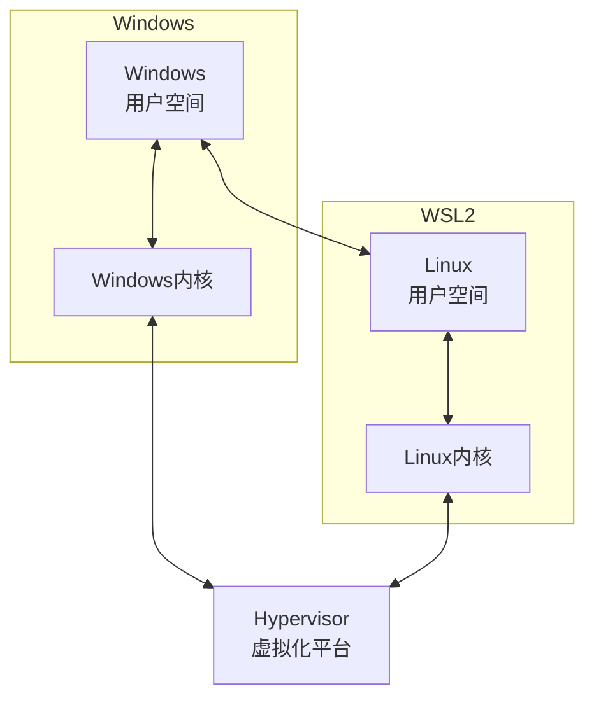

# wsl2

这一个 md 主要是 wsl 的配置. 尤其是它怎么和 windows 共享文件, 以及怎么使用好的 GUI 等

source: https://www.bilibili.com/video/BV1tW42197za/?spm_id_from=333.788.top_right_bar_window_history.content.click&vd_source=066049b980b7b1b5468665a1f1c36b14

### wsl1 和 wsl2 的架构区别(简)

wsl 1 本质上是一个翻译机. 它把 Linux cmds 翻译为 windows cmds, 而不是运行真正的 Linux cmds. 所以本质上是用 windows 的 kernel 模拟 Linux kernel, 因而总会有一些指令上的兼容问题

而 wsl2 是基于 hyperv 虚拟机的

通过 Hyperv 的虚拟化技术, wsl2 甚至可以显卡直连.

### wsl2 的使用前置

1. 打开 cpu 的 virtualization. 

	通常是默认打开的. 可以打开任务管理器然后在 CPU 这一块查看有没有打开. 没有的话需要进 BIOS 打开

2. 任务栏打开 "启用或关闭 windows 功能" (Turn Windows features on or off), 在里面启用 Virtual Machine Platform, Windows Hypervisor Platform 以及 Windows Subsystem for Linux

然后重启

### 如何保存和载入整个 wsl

